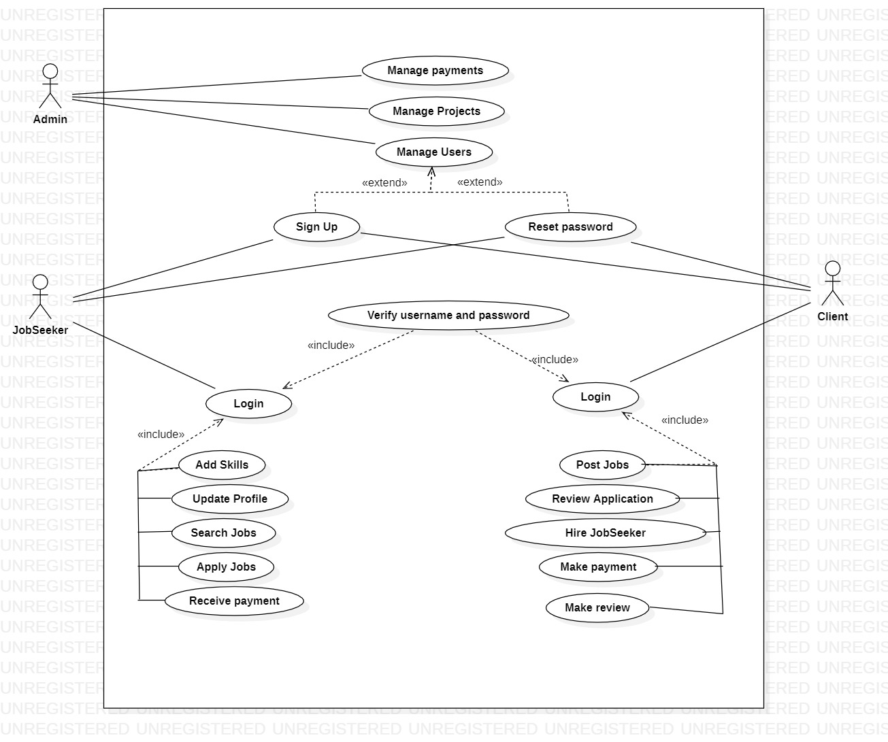
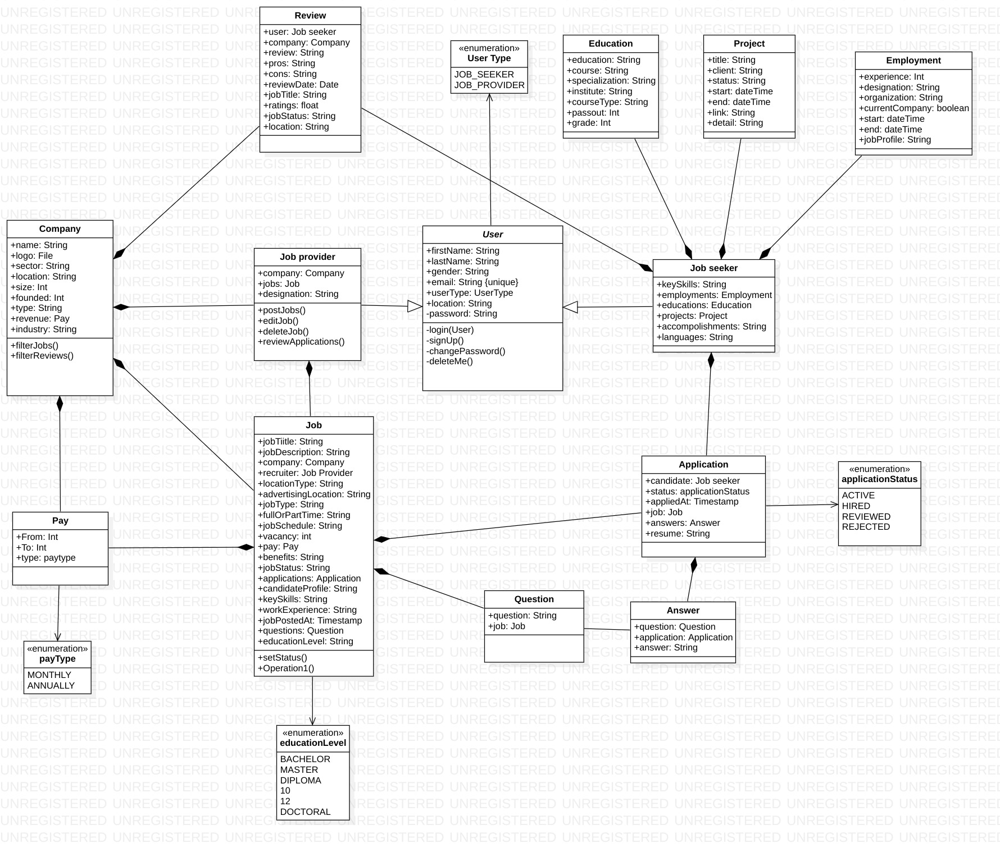
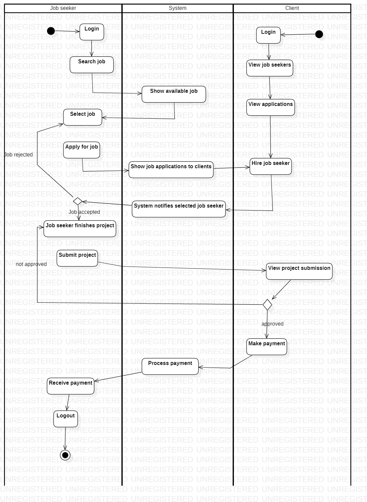

# **Freelance Marketplace Job Portal**

### **Overview**
The Freelance Marketplace Job Portal is an Object-Oriented Analysis and Design (**OOAD**) project that simulates an online platform connecting **job providers** with **freelancers**. It allows job providers to post projects and hire skilled freelancers, while freelancers can bid for jobs based on their expertise. 

---

## **Features**
### **1. User Management**
- **Two roles**:
  - **Job Provider**: Posts jobs and reviews freelancers.
  - **Freelancer**: Bids for jobs and delivers work.
- User authentication and authorization.

### **2. Job Posting and Bidding**
- Job providers can create detailed job postings.
- Freelancers can bid on jobs with a proposed timeline and cost.
- Bid review and acceptance by job providers.

---

## **Technologies Used**
- **Programming Language**: Java SE 17.0.2
- **Database**: MySQL 8.0
- **Database Connectivity**: JDBC 4.3
- **Tools for OOAD**:
  - ArgoUML/StarUML for diagram design
---

## **OOAD Components**
### **UML Diagrams**
1. **Use Case Diagram**:
   - Captures interactions between users (job providers and freelancers) and the system.
     

2. **Class Diagram**:
   - Represents system structure, showing classes such as `User`, `Job`, `Application`, etc., and their relationships.
     
3. **Activity Diagram**:
   - Illustrates the flow of actions for job application and job completion.
     

### **Design Patterns**
- **Singleton**: For managing system configurations and database connections.
- **Factory Pattern**: For creating different types of users (e.g., job provider and freelancer).

---

## **Project Structure**

### Directory Details:
- **`META-INF/`**: Contains meta information about the project, often used for configurations and application settings.
- **`bin/`**: Contains the compiled Java bytecode files (`.class` files).
- **`docs/`**: Stores UML diagrams (e.g., use case, class, sequence, activity diagrams) and any additional project documentation.
- **`lib/`**: External libraries required for the project.
- **`src/`**: Source code for the application, including Java classes and logic (in the `com/jobportal/application/` directory).
- **`Job-Portal.jar`**: The JAR file containing the packaged application for execution.
- **`README.md`**: Provides an overview of the project, including setup and usage instructions.

